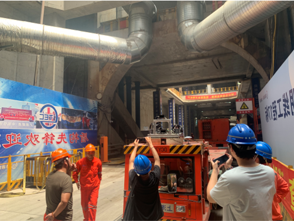

  

    
    

    <strong>Shanghai Tunnel Project.</strong> 
    <strong>Horizontal Research Project</strong> 
    June. 2024 – Sept. 2024 
    Main tasks: assisting in the construction of LIDAR equipment at the Shanghai Tunnel project site, assisting in the calibration of multiple LIDARs, and completing the recording of RTK and LIDAR datasets at the site.
    

  

  

    
    

    <strong>Autonomous Valet Parking.</strong> 
    <strong>Personal Research Project</strong> 
    Jan. 2025 - Now 
    Main Tasks: A method for constructing semantic maps of underground parking lots based on the Inverse Perspective Mapping (IPM) is being realized and evaluated. SLAM localization algorithm based on multiple LiDAR/IMU fusion for underground parking environment with missing GPS signals and sparse features.
    

  

