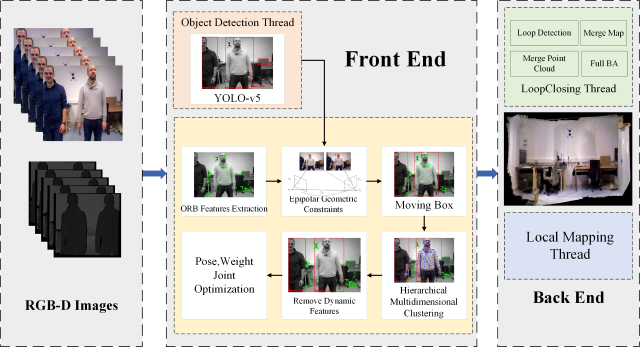
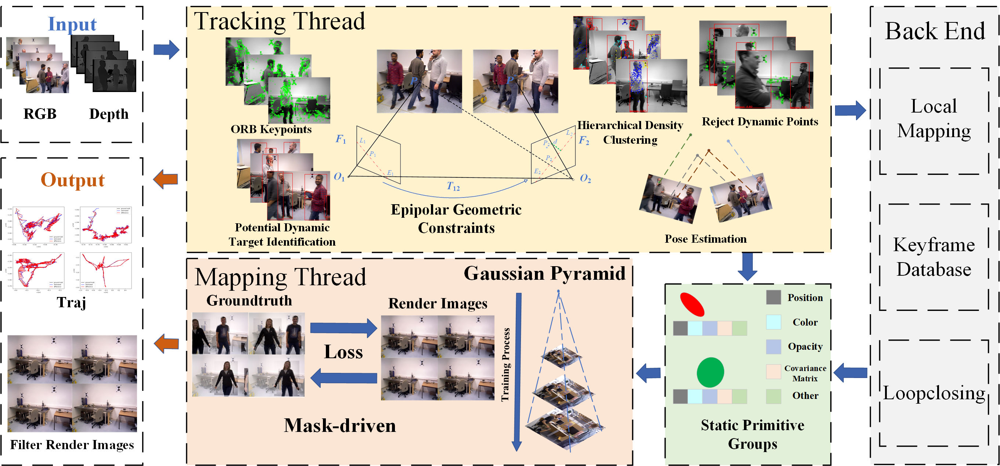
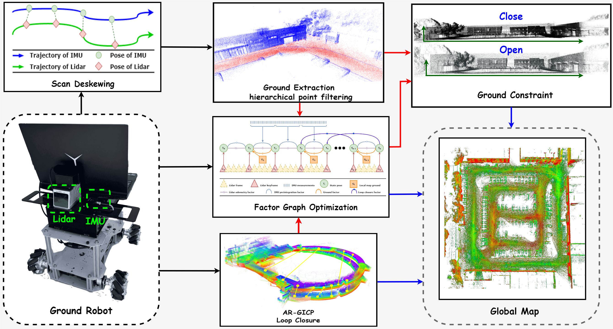
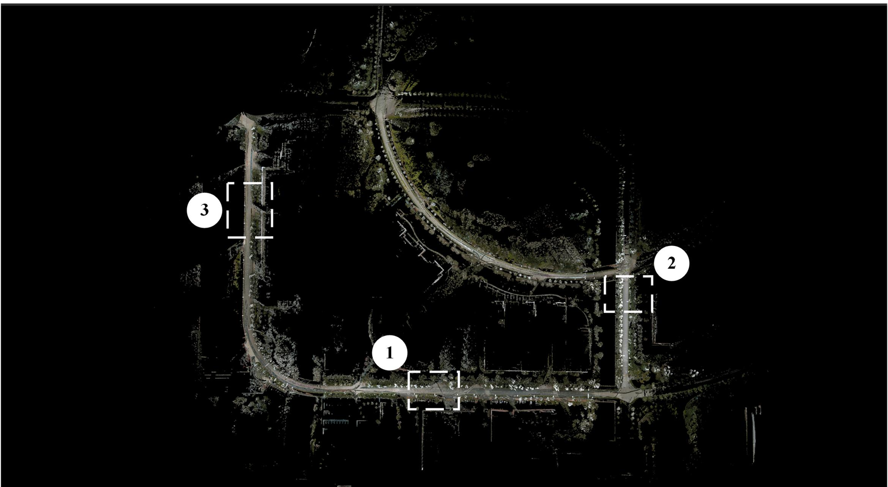

\* indicates corresponding author

  

    
    

    <strong>HMC-SLAM: A Robust VSLAM Based on RGB-D Camera in Dynamic Environment Combined Hierarchical Multidimensional Clustering Algorithm.</strong> 
    <strong>IEEE Transactions on Instrumentation and Measurement,2025</strong> 
    <strong>Bowen Xu</strong>, Zexuan Zheng, Zihao Pan and Lei Yu*. 
    <a href="../static/cv/HMC-SLAM_A_Robust_VSLAM_Based_on_RGB-D_Camera_in_Dynamic_Environment_Combined_Hierarchical_Multidimensional_Clustering_Algorithm.pdf">[Paper]</a>.<strong>Accept</strong>
    

  

  

    
    

    <strong>Stagauss-SLAM: A Robust RGBD Dense SLAM Algorithm for Dynamic Scenes.</strong> 
    <strong>IEEE Robotics and Automation Letters,2025</strong> 
    <strong>Bowen Xu</strong>, Feifan Bian, Zihao Pan, Junyi Hou and Lei Yu*. 
    <strong>Under Review</strong>
    

  

  

    
    

    <strong>Enhanced 3D LiDAR-Inertial SLAM for Large-Scale Outdoor Environments Using Local Ground Constraints.</strong> 
    <strong>Measurement,2025</strong> 
    Zexuan Zheng, Tingtao Wei, <strong>Bowen Xu</strong>, Junyi Hou and Lei Yu*. 
    <strong>Accept</strong>
    

  

  

    
    

    <strong>3D Reconstruction Algorithm of Complex Large Scenes based on ESIKF and Xfeat Feature Match.</strong> 
    <strong>Expert Systems with Applications,2025</strong> 
    Chenxi Zhao, Tingtao Wei, <strong>Bowen Xu</strong>, Zihao Pan, Junyi Hou and Lei Yu*. 
    <strong>Under Review</strong>
    

  

